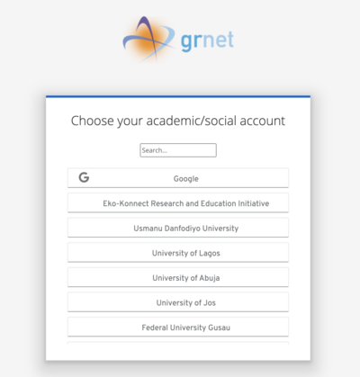

# ARGO-accounting
ARGO Accounting

This project uses Quarkus, the Supersonic Subatomic Java Framework.

## Prerequisites

-   Java 11+
-   Apache Maven 3.8.1+
-   Docker (for dev mode)

## Dev Services

Quarkus supports the automatic provisioning of unconfigured services in development and test mode. 
They refer to this capability as Dev Services. 
From a developer’s perspective this means that if you include an extension and don’t configure it then Quarkus will automatically start the relevant service (usually using Testcontainers behind the scenes) 
and wire up your application to use this service.

## Running the application in dev mode

You can run your application in dev mode that enables live coding using:
```shell script
mvn clean compile quarkus:dev
```

## Packaging and running the application

The application can be packaged using:
```shell script
mvn clean package
```
It produces the `quarkus-run.jar` file in the `target/quarkus-app/` directory.
Be aware that it’s not an _über-jar_ as the dependencies are copied into the `target/quarkus-app/lib/` directory.

The application is now runnable using `java -jar target/quarkus-app/quarkus-run.jar`.

If you want to build an _über-jar_, execute the following command:
```shell script
mvn clean package -Dquarkus.package.type=uber-jar
```

The application, packaged as an _über-jar_, is now runnable using `java -jar target/*-runner.jar`.

## Creating a native executable

You can create a native executable using:
```shell script
mvn clean package -Pnative
```

Or, if you don't have GraalVM installed, you can run the native executable build in a container using:
```shell script
mvn clean package -Pnative -Dquarkus.native.container-build=true
```

You can then execute your native executable with: `./target/rest-json-quickstart-1.0.0-SNAPSHOT-runner`

If you want to learn more about building native executables, please consult https://quarkus.io/guides/maven-tooling.

## Mongo Database

When running the production version of the application, the MongoDB connection needs to be configured as normal by setting the connection string in `quarkus.mongodb.connection-string`.
If you want to continue use Dev Services we recommend that you use the `%prod.` profile to define your MongoDB settings. What that means practically, is that Quarkus
will automatically start a MongoDB container when running tests or dev-mode, and automatically configure the connection.

## Unit and Metric type

The possible values of `unit_type` and `metric_type` are defined in two separate files, `unit_type.conf` and `metric_type.conf` respectively.
The application reads those files and offers to the clients the available values by the respective GET requests.
You can set the path to those files by filling in the following attributes in the `application.properties`:
-   `unit.types.file`
-   `metric.types.file`

Finally, under the folder `/files`, you can find samples of those files.

## Authentication

To access Accounting System API resources, you have to be authenticated by GRNET's keycloak. These resources are protected and can only be accessed if a client is sending a bearer token along with the request,
which must be valid and trusted by the Accounting System API.

### Authentication via Keycloak Login Page

The GRNET's keycloak offers various Identity Providers where the authentication process can be performed.



Once you log in to your preferable Identity Provider, you obtain an access token. Using this token, you can access the available API operations.

When passing in the access token in an HTTP header, you should make a request like the following:

```bash
curl http://localhost:8080/accounting-system/metric-definition
   -H "Authorization: Bearer {token}"
```

There is an ancillary web page at `{accounting_system_host}` where you can identify yourself. This page is responsible for :
-   redirecting a user to Keycloak's login page in order to be authenticated
-   displaying the obtained token

Generally, [the ancillary web page](src/main/resources/templates/keycloak.html) applies a client-side JavaScript library that can be used to secure HTML5/JavaScript applications. 
More details you can find [here](https://github.com/keycloak/keycloak-documentation/blob/main/securing_apps/topics/oidc/javascript-adapter.adoc). If you want to secure your application,
you can apply any of the available [Keycloak adapters](https://www.keycloak.org/docs/latest/securing_apps/#_oidc).

### Client Credentials Flow

The Accounting System API also needs to authenticate services. For this scenario, 
typical authentication schemes like username + password don't make sense.  Instead, the services use the Client Credentials Flow 
, in which they pass along their Client ID and Client Secret to authenticate themselves and get an access token.

The Client ID and Client Secret are generated by Keycloak and provided by GRNET. Once the service acquires them, it can obtain 
a token by executing the following HTTP request:
```bash
curl --location --request POST 'https://keycloak/auth/realms/einfra/protocol/openid-connect/token' \
--header 'Content-Type: application/x-www-form-urlencoded' \
--data-urlencode 'client_id=<CLIENT_ID>' \
--data-urlencode 'client_secret=<CLIENT_SECRET>' \
--data-urlencode 'grant_type=client_credentials'
```

### Integrating with TestContainer in Dev mode

Quarkus starts a Keycloak container for both the dev and/or test modes and initializes them by registering the existing Keycloak realm or 
creating a new realm with the client and users for you to start developing the Accounting System application secured by Keycloak immediately. 
More details about how to obtain access tokens in dev mode you can find [here](https://quarkus.io/guides/security-openid-connect-dev-services).

### Integrating with External keycloak in Dev mode

If you want to integrate with external keycloak, you have to remove the prefix `%prod.` from `%prod.quarkus.oidc.auth-server-url`. 
Then you have to configure the following variables in `application.properties`:
-   `quarkus.oidc.auth-server-url={The base URL of the Keycloak server. The base URL will be in the following format: https://host:port/auth/realms/{realm}.`
-   `quarkus.oidc.client-id={Specifies an alpha-numeric string that will be used as the client identifier for OIDC requests}`
-   `quarkus.oidc.credentials.secret={Client secret which is used for a client_secret_basic authentication method}`
-   `%dev.key.to.retrieve.roles.from.access.token=roles`

To use a UI Page to obtain an access token from the external keycloak, which will be accessible at {accounting_system_host}, you have to configure the following variables in `application.properties`:

-   `keycloak.server.url={The base URL of Keycloak server. Make sure the base URL is in the following format: https://host:port/auth}`
-   `keycloak.server.realm={The name of the Keycloak realm}`
-   `keycloak.server.client.id={Specifies an alpha-numeric string that will be used as the client identifier for OIDC requests}`

The `keycloak.server.url`, `keycloak.server.realm` and `keycloak.server.client.id` are used in order to feed the [keycloak.html](src/main/resources/templates/keycloak.html) template.
There also is an [endpoint](src/main/java/org/accounting/system/templates/KeycloakClientTemplate.java) which is responsible for rendering that html page.

## Authorization

Collection-level permissions control services’ access to the collection. Collection permissions are configured using roles, and each collection contains a set of roles that allows services to create, read, update and delete entities of that collection.
We assign permissions to services based on their roles. A role is a collection of permissions that you can apply to services. We can assign one or more roles to each service and one or more permissions to each role.

To generate a role, we have to define the available API operations and access types. By combining operations and access types, you can generate permissions and then you can assign these permissions to each role.

### Operations

The available API operations are:

| Operation   |  Description                                                                             |
| ------------|----------------------------------------------------------------------------------------  | 
| Create      | Can create new entities within a collection                                              |
| Update      | Can update existing entities within a collection                                         |
| Delete      | Can delete existing entities within a collection                                         |
| Read        | Can fetch existing entities within a collection                                          |
| Acl         | Can specify which services are granted access to particular entities within a collection |

### Access Types

The following table illustrates the available access types:

| Access Type |  Description                                                 |
| ------------|------------------------------------------------------------- | 
| Always      | Services are always able to perform this operation           |
| Never       | Services are never able to perform this operation            |
| Entity      | Services have only access to entities that they have created |

If the service has more than one role :

-   If the access types are __Always__ and __Entity__, the service will have __Always access__, because this access type is the most permissive and will override the others. In other words, the __most permissive access type__ takes precedence.
-   __Never__ always takes precedence over any other access type.

### Collections

The available Accounting System API collections are:

| Collections      |
| -----------------| 
| MetricDefinition | 
| Metric           | 
| Role             | 
| Provider         | 
| Installation     |

### Examples

Based on the above, we can generate some indicative roles:

| Role                      | Create | Update | Delete  | Read   | Acl    | Collection       |
| ------------------------- |--------| -------| --------| -------| -------|------------------|
| metric_definition_admin   | Always | Always | Always  | Always | Always | MetricDefinition |
| metric_inspector          |        |        |         | Always |        | Metric           |
| metric_creator            | Always | Entity | Entity  | Entity | Entity | Metric           |
| role_editor               | Always | Always | Never   | Always |        | Role             |

__Notes:__ 
-   The role name should be unique.
-   The blank value is converted to "Never" value

Consequently:
-   __metric_definition_admin__ can create new Metric Definitions, as well as update, delete and read any entity in the collection. Can also specify which services will be granted access to any entity within a Metric Collection. In other words, __metric_definition_admin__ will always be able to perform any operation in the Metric Definition collection.
-   __metric_inspector__  can read any entity in the Metric collection, but cannot create new ones or update, delete any Metrics.
-   __metric_creator__ can create new Metrics, but can update, delete or read only its Metrics. It can also specify which services will have access to the entities it has created. Finally, it can also manage Metrics that have been explicitly declared through the ACL process.
-   __role_editor__ can create new Roles, as well as update, and read any entity in the Role collection but cannot delete any entity in it.

### Generating new Roles via Accounting System API

It is possible to create and manage new roles using the API. It should be noted that only the __system_admin__ role, which is initialized in the API, can create and manage roles through the API.
Consequently, it is the only role that can grant access to other roles.

#### Create a new Role

We can create the aforementioned roles by executing the following requests:

-   metric_definition_admin
```bash
POST 'https://host/accounting-system/roles' 

{
  "name" : "metric_definition_admin",
  "collection_permission_list":[
    {
    "collection": "MetricDefinition",
    "permissions" :[
      {
        "operation" : "CREATE",
        "access_type" : "ALWAYS"
      },
      {
        "operation" : "UPDATE",
        "access_type" : "ALWAYS"
      },
      {
        "operation" : "DELETE",
        "access_type" : "ALWAYS"
      },
      {
        "operation" : "READ",
        "access_type" : "ALWAYS"
      },
      {
        "operation" : "ACL",
        "access_type" : "ALWAYS"
      },
    ]
    },
  
]
}
```
-   metric_inspector
```bash
POST 'https://host/accounting-system/roles' 

{
  "name" : "metric_inspector",
  "collection_permission_list":[
    {
    "collection": "Metric",
    "permissions" :[
      {
        "operation" : "READ",
        "access_type" : "ALWAYS"
      }
    ]
    },
  
]
}
```
-   metric_creator
```bash
POST 'https://host/accounting-system/roles' 

{
  "name" : "metric_creator",
  "collection_permission_list":[
    {
    "collection": "Metric",
    "permissions" :[
      {
        "operation" : "CREATE",
        "access_type" : "ALWAYS"
      },
      {
        "operation" : "UPDATE",
        "access_type" : "ENTITY"
      },
      {
        "operation" : "DELETE",
        "access_type" : "ENTITY"
      },
      {
        "operation" : "READ",
        "access_type" : "ENTITY"
      },
      {
        "operation" : "ACL",
        "access_type" : "ENTITY"
      }
    ]
    },
  
]
}
```
-   role_editor
```bash
POST 'https://host/accounting-system/roles' 

{
  "name" : "role_editor",
  "collection_permission_list":[
    {
    "collection": "Role",
    "permissions" :[
      {
        "operation" : "CREATE",
        "access_type" : "ALWAYS"
      },
      {
        "operation" : "UPDATE",
        "access_type" : "ALWAYS"
      },
      {
        "operation" : "DELETE",
        "access_type" : "NEVER"
      },
      {
        "operation" : "READ",
        "access_type" : "ALWAYS"
      }
    ]
    },
  
]
}
```
You can also create a more generic role. For example, the __editor__ can create new Roles, Metrics, and Metric Definitions, as well as update, and read any entity in those collections. But cannot delete any entity:

-   editor
```bash
POST 'https://host/accounting-system/roles' 

{
  "name" : "editor",
  "collection_permission_list":[
    {
    "collection": "Role",
    "permissions" :[
      {
        "operation" : "CREATE",
        "access_type" : "ALWAYS"
      },
      {
        "operation" : "UPDATE",
        "access_type" : "ALWAYS"
      },
      {
        "operation" : "READ",
        "access_type" : "ALWAYS"
      }
    ]
    },
   {
    "collection": "Metric",
    "permissions" :[
      {
        "operation" : "CREATE",
        "access_type" : "ALWAYS"
      },
      {
        "operation" : "UPDATE",
        "access_type" : "ALWAYS"
      },
      {
        "operation" : "READ",
        "access_type" : "ALWAYS"
      }
    ]
    },
  {
    "collection": "MetricDefinition",
    "permissions" :[
      {
        "operation" : "CREATE",
        "access_type" : "ALWAYS"
      },
      {
        "operation" : "UPDATE",
        "access_type" : "ALWAYS"
      },
      {
        "operation" : "READ",
        "access_type" : "ALWAYS"
      }
    ]
    }
]
}
```
### Assigning roles to Services/Users

The generated roles can be assigned to different users or services via Keycloak.


## Deploying the Accounting System API

To deploy the API in a machine :

-   First, you have to set up a mongo database (We are currently using `4.0.28`, but other versions may be compatible)
-   Second, you have to put the `unit_type.conf` and `metric_type.conf` in the machine filesystem
-   Third, there must be an _über-jar_ version of the API on this machine

Before running the _über-jar_, you have to export the following variables:
```bash
- export QUARKUS_MONGODB_CONNECTION_STRING=mongodb://{host}:{port}
- export UNIT_TYPES_FILE={filesystem path to unit_type.conf}
- export METRIC_TYPES_FILE={filesystem path to metric_type.conf}
- export SERVER_URL={The proxy server URL that acts on behalf of the Accounting System}
- export QUARKUS_OIDC_AUTH_SERVER_URL={The base URL of the OpenID Connect (OIDC) server. Note if you work with Keycloak OIDC server, make sure the base URL is in the following format: https://host:port/auth/realms/{realm} where {realm} has to be replaced by the name of the Keycloak realm}
- export QUARKUS_OIDC_CLIENT_ID={Specifies an alpha-numeric string that will be used as the client identifier for OIDC requests}
- export QUARKUS_OIDC_CREDENTIALS_SECRET={Client secret which is used for a client_secret_basic authentication method}
- export KEYCLOAK_SERVER_URL={The base URL of Keycloak server. Make sure the base URL is in the following format: https://host:port/auth}
- export KEYCLOAK_SERVER_REALM={The name of the Keycloak realm}
- export KEYCLOAK_SERVER_CLIENT_ID={Specifies an alpha-numeric string that will be used as the client identifier for OIDC requests}
```

Once the variables above have been exported, you should execute the following command:
`java -jar *-runner.jar`

## Expose OpenAPI Specifications

Once the application is started, you can make a request to the `/open-api` endpoint:

`curl {accounting_system_host}/open-api`

## Swagger UI

Swagger UI is accessible at `/swagger-ui` endpoint:

`{accounting_system_host}/swagger-ui`