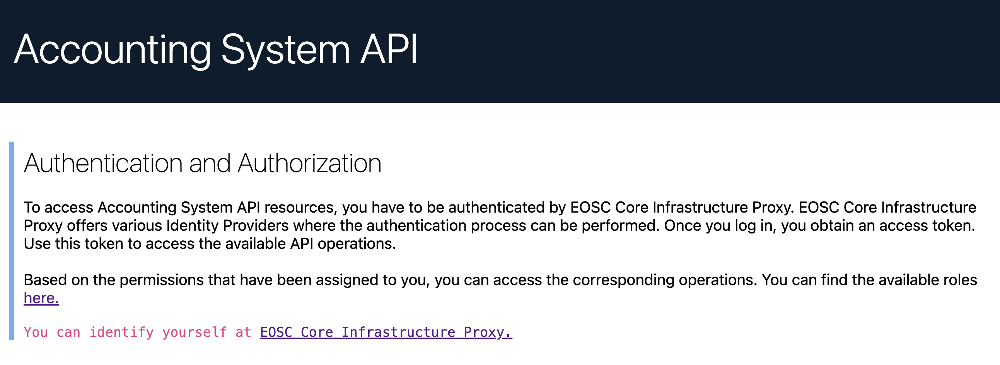

To access Accounting System API resources, you have to be authenticated by EOSC Core Infrastructure proxy. 
These resources are protected and can only be accessed if a client is sending a bearer token along with the request, which must be valid and trusted by the Accounting System API.

The EOSC Core Infrastructure Proxy offers various Identity Providers where the authentication process can be performed. Once you log in to your preferable Identity Provider, you obtain an access token. Using this token, you can access the available API operations.

When passing in the access token in an HTTP header, you should make a request like the following:

```bash
curl http://localhost:8080/accounting-system/metric-definitions
   -H "Authorization: Bearer {token}"
```

There is an ancillary web page at [Accounting Service](https://accounting.devel.argo.grnet.gr) where you can identify yourself. 



To proceed, please click on `EOSC Core Infrastructure Proxy`. Then, click the `Authorise` button.


Subsequently, choose your preferred Account to authenticate yourself.

    

Upon successful login, the obtained token is displayed.

    
