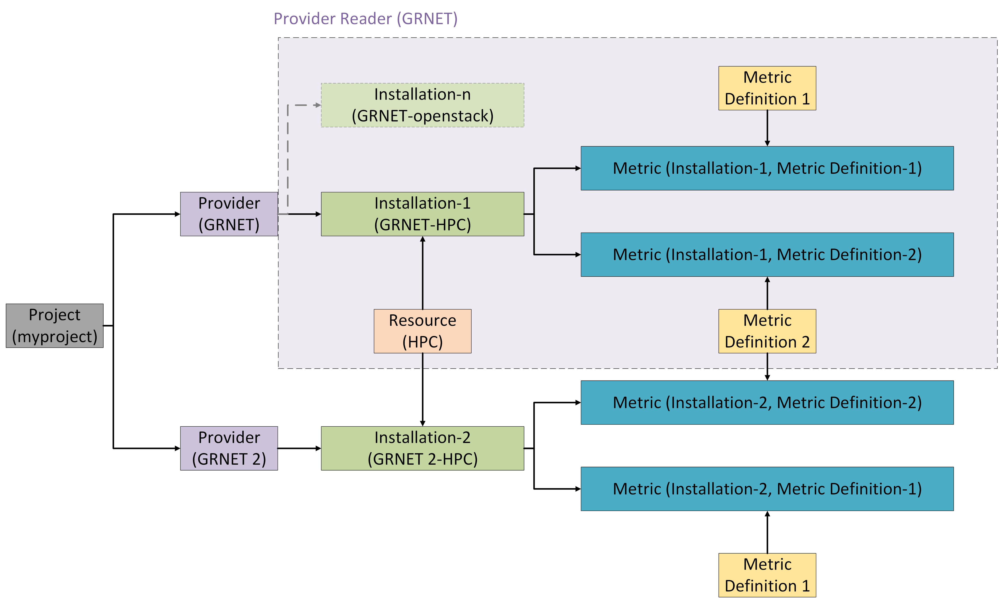
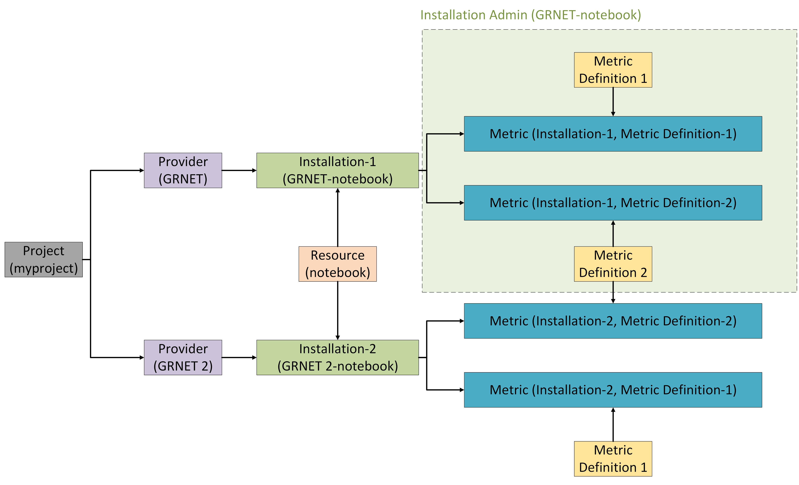
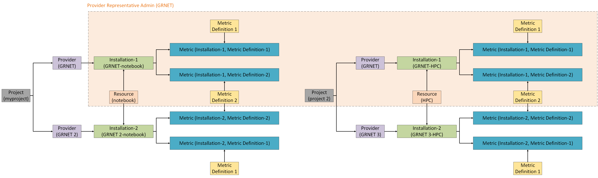
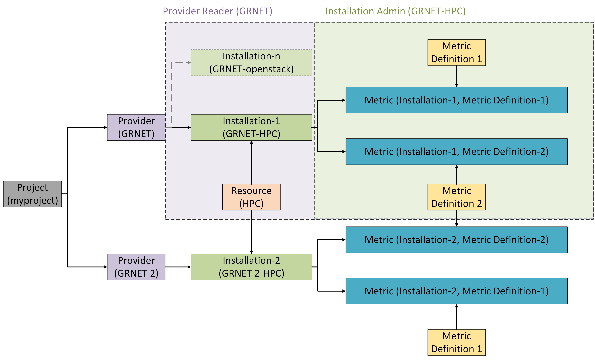
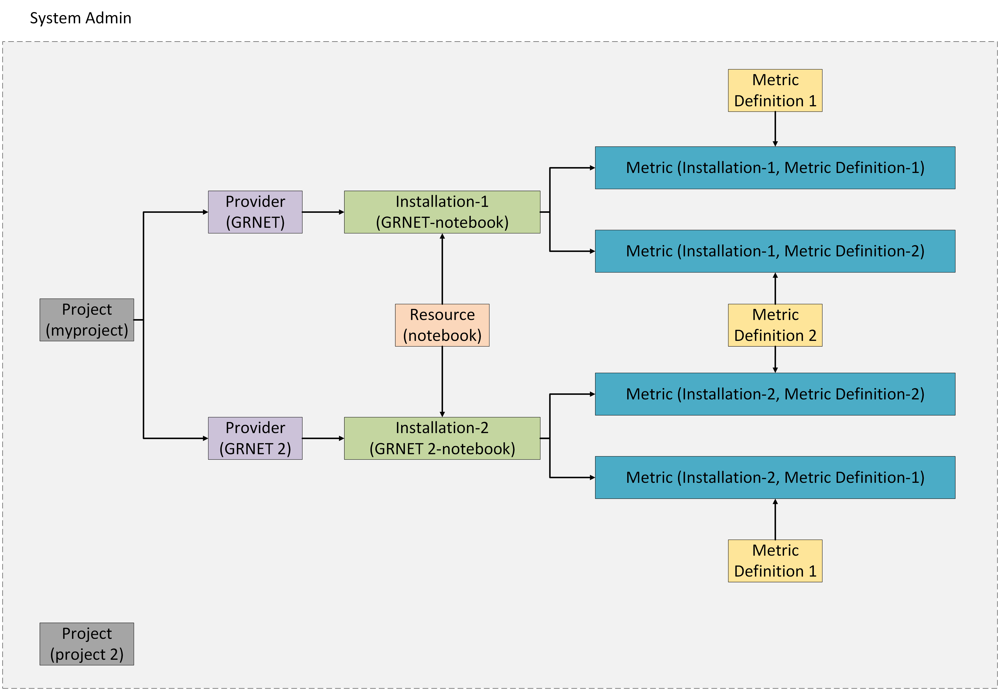

# Accounting Roles

The Accounting Service launched a flexible, database-driven role management system using AAI-style groups and entitlements for centralized and secure access control, simplifying the codebase and enabling flexible role management.

## What It Offers

- **Centralized access control** database-driven role management through AAI-style groups and entitlements, ensuring consistent permissions across services.
- **Flexible role management**: easily integrate custom roles such as *Project Viewer* or *Installation Admin*.
- **Enhanced security** with unified, policy-driven authorization and auditing capabilities.

---

## Mapping of Roles to Entitlements

This section defines how system roles are linked to AAI-style entitlements (roles, groups, and permissions) that grant specific access rights.

## Project Viewer/Admin

**Entitlements:**

- `<NAMESPACE>:group:accounting:myproject:role=viewer/admin`
- `<NAMESPACE>:group:accounting:operations:resources:role=viewer/admin`

**Description:**

- Grants project-level administration for `myproject`, and its underneath sub-groups in view/admin mode.
- Allows creation of providers, metric definitions, metric types, unit types, and installation's resources.

For the viewer role (`role=viewer`), access is read-only. For the admin role (`role=admin`), full create/update/delete permissions are granted where applicable.

**Permissions on Assigned Project and its Related Entities:**

| Collection   | Create | Update | Delete | Read   |
|--------------|--------|--------|--------|--------|
| Provider     | Always (admin only) | Entity* (admin only) | Entity* (admin only) | Always |
| Installation | Always (admin only) | Entity* (admin only) | Entity* (admin only) | Always |
| Metric       | Always (admin only) | Entity* (admin only) | Entity* (admin only) | Always |

\* Cannot update or delete if entity is associated with other entities (e.g. metrics have been collected).

## Provider Viewer/Admin within Project

**Entitlements:**

- `<NAMESPACE>:group:accounting:myproject:GRNET:role=viewer/admin`
- `<NAMESPACE>:group:accounting:operations:resources:role=viewer/admin`

**Description:**

- Grants administration for a specific provider (`GRNET`) within project `myproject`, and its underneath sub-groups, in view/admin mode.
- Allows creation of providers, metric definitions, metric types, unit types, and installation's resources.

For the viewer role (`role=viewer`), access is read-only. For the admin role (`role=admin`), full create/update/delete permissions are granted where applicable.

**Permissions on Assigned Provider within Project and its Related Entities:**

| Collection   | Create | Update | Delete | Read   |
|--------------|--------|--------|--------|--------|
| Installation | Always (admin only) | Entity* (admin only) | Entity* (admin only) | Always |
| Metric       | Always (admin only) | Entity* (admin only) | Entity* (admin only) | Always |

\* Cannot update or delete if entity is associated with other entities (e.g. metrics have been collected).

## Installation Viewer/Admin

**Entitlements:**

- `<NAMESPACE>:group:accounting:myproject:GRNET:GRNET-notebook:role=viewer/admin`
- `<NAMESPACE>:group:accounting:operations:resources:role=viewer/admin`

**Description:**

- Grants administration for installation `GRNET-notebook` under provider `GRNET` in project `myproject`, and its underneath sub-groups, in view/admin mode.
- Allows creation of providers, metric definitions, metric types, unit types, and installation's resources.

For the viewer role (`role=viewer`), access is read-only. For the admin role (`role=admin`), full create/update/delete permissions are granted where applicable.

**Permissions on Assigned Installation and its Related Entities:**

| Collection   | Create | Update | Delete | Read   |
|--------------|--------|--------|--------|--------|
| Installation | - | Entity* (admin only) | Entity* (admin only) | Always |
| Metric       | Always (admin only) | Entity* (admin only) | Entity* (admin only) | Always |

\* Cannot update or delete if entity is associated with other entities (e.g. metrics have been collected).

## Provider Representative Viewer/Admin

**Entitlements:**

- `<NAMESPACE>:group:accounting:roles:provider:GRNET:role=viewer/admin`
- `<NAMESPACE>:group:accounting:operations:resources:role=viewer/admin`

**Description:**

- Provider Representative can view/admin provider `GRNET` in all projects where `GRNET` is associated with.
- Allows creation of providers, metric definitions, metric types, unit types, and installation's resources.

For the viewer role (`role=viewer`), access is read-only across associated projects. For the admin role (`role=admin`), full create/update/delete permissions are granted where applicable.

**Permissions on Associated Providers and their Related Entities:**

| Collection   | Create | Update | Delete | Read   |
|--------------|--------|--------|--------|--------|
| Installation | Always (admin only) | Entity* (admin only) | Entity* (admin only) | Always |
| Metric       | Always (admin only) | Entity* (admin only) | Entity* (admin only) | Always |

\* Cannot update or delete if entity is associated with other entities (e.g. metrics have been collected).

## Custom Roles: Project Provider Reader and Installation Admin

**Entitlements:**

- `<NAMESPACE>:group:accounting:myproject:GRNET:role=viewer`
- `<NAMESPACE>:group:accounting:myproject:GRNET:GRNET-HPC:role=admin`
- `<NAMESPACE>:group:accounting:operations:resources:role=viewer`

**Description:**

- Grants administration for a specific provider (`GRNET`) within project `myproject`, and its underneath sub-groups, in view mode.
- Grants administration for installation `GRNET-HPC` under provider `GRNET` in project `myproject`, and its underneath sub-groups in admin mode.
- Allows only to view resources: providers, metric definitions, metric types, unit types, and installation's resources.

**Permissions:**

| Collection   | Create | Update | Delete | Read   |
|--------------|--------|--------|--------|--------|
| Provider     | -      | -      | -      | Always |
| Installation | -      | Entity* (on GRNET-HPC) | Entity* (on GRNET-HPC) | Always |
| Metric       | -      | Entity* (on GRNET-HPC) | Entity* (on GRNET-HPC) | Always |

\* Cannot update or delete if entity is associated with other entities (e.g. metrics have been collected).

## System Viewer/Admin

**Entitlements:**

- `<NAMESPACE>:group:accounting:role=viewer/admin`

**Description:**

- System-wide role: full access to view/manage providers, projects, installations, and resources (metric definitions, metric types, unit types, and installation's resources).

For the viewer role (`role=viewer`), access is read-only across the system. For the admin role (`role=admin`), full create/update/delete permissions are granted system-wide.

**System-Wide Permissions:**

| Collection       | Create | Update | Delete | Read   |
|------------------|--------|--------|--------|--------|
| Provider         | Always (admin only) | Entity* (admin only) | Entity* (admin only) | Always |
| Project          | Always (admin only) | Always (admin only) | Always (admin only) | Always |
| Installation     | Always (admin only) | Always (admin only) | Always (admin only) | Always |
| Metric           | Always (admin only) | Always (admin only) | Always (admin only) | Always |
| MetricDefinition | Always (admin only) | Entity** (admin only) | Entity** (admin only) | Always |
| UnitType         | Always (admin only) | Entity*** (admin only) | Entity*** (admin only) | Always |
| MetricType       | Always (admin only) | Entity**** (admin only) | Entity**** (admin only) | Always |

\* Cannot update or delete if belongs to a project.  
** Cannot update or delete if metrics are assigned.  
*** Cannot update or delete if registered by service or used in metric definition.  
**** Cannot update or delete if registered by service or used in metric definition.

