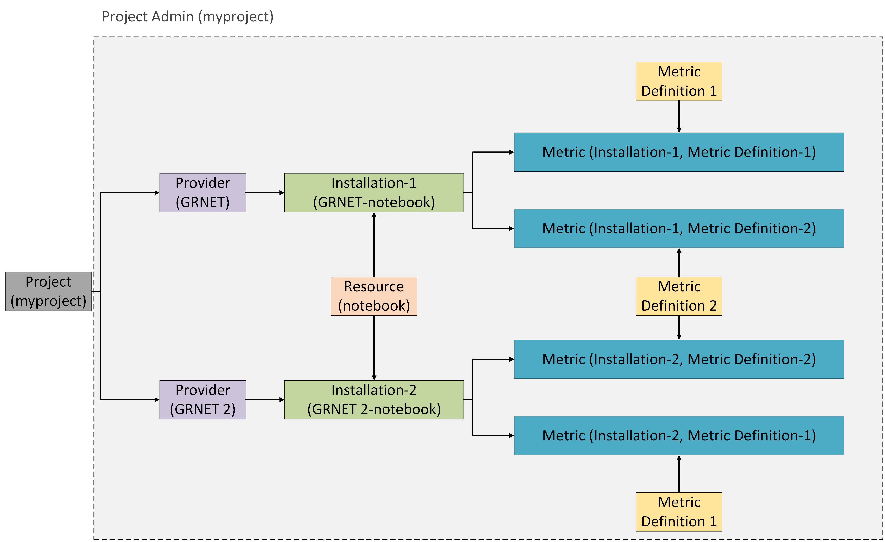

# Setting up a Project

To be able to set up a particular Project, you must be the `Project Admin`
of that Project.
See [here](/docs/guides/api_actions/projects.md) how you can obtain that
role.

## Step 1: Associate Providers with the Project

### Create a new Provider

---

- **User Interface**
  To perform this action via the website, please click [here](https://accounting.eosc-portal.eu/providers)
and follow the provided [instructions](https://argoeu.github.io/argo-accounting/docs/guides/ui_actions/provider#create-a-provider).

- **HTTP Request**
  To syntax the HTTP request, please visit the corresponding [document](https://argoeu.github.io/argo-accounting/docs/api/provider#post---create-a-new-provider).

### Connect Providers with the Project

---

- **User Interface**
  To perform this action via the website, please click [here](https://accounting.eosc-portal.eu/projects)
and follow the provided [instructions](https://argoeu.github.io/argo-accounting/docs/guides/ui_actions/project#associate-providers-with-a-specific-project).

- **HTTP Request**
  To syntax the HTTP request, please visit the corresponding [document](https://argoeu.github.io/argo-accounting/docs/api/project#post---associate-providers-with-a-specific-project).

## Step 2: Create a new Installation and assign it to the associated Providers

> **Note**
>
> As indicated in the Installation [documentation](https://argoeu.github.io/argo-accounting/docs/api/installation),
the `unit_of_access` Installation property must point to an existing Metric Definition.
You can either create a new Metric Definition or use an existing one.

### View all the Metric Definitions

---

- **User Interface**
  View Metric Definitions on the [website](https://accounting.eosc-portal.eu/metrics-definitions).

- **HTTP Request**
  To syntax the HTTP request, please visit the corresponding [document](https://argoeu.github.io/argo-accounting/docs/api/metric_definition#get----fetch-all-metric-definitions).

### Create a new Metric Definition

---

- **User Interface**
  To perform this action via the website, please click [here](https://accounting.eosc-portal.eu/metrics-definitions)
and follow the provided [instructions](https://argoeu.github.io/argo-accounting/docs/guides/ui_actions/metric_definition#create-a-metric-definition).

- **HTTP Request**
  To syntax the HTTP request, please visit the corresponding [document](https://argoeu.github.io/argo-accounting/docs/api/metric_definition#post---create-a-metric-definition).

### Create a new Installation

---

- **User Interface**
  To perform this action via the website, please click [here](https://accounting.eosc-portal.eu/installations)
and follow the provided [instructions](https://argoeu.github.io/argo-accounting/docs/guides/ui_actions/installation#create-a-new-installation).

- **HTTP Request**
  To syntax the HTTP request, please visit the corresponding [document](https://argoeu.github.io/argo-accounting/docs/api/installation#post---create-a-new-installation).

## Step 3: Add Metrics

### Add Metrics to a particular Project

---

- **User Interface**
  To perform this action via the website, please follow the provided [instructions](https://argoeu.github.io/argo-accounting/docs/guides/ui_actions/project#manage-project-metrics).

- **HTTP Request**
  To syntax the HTTP request, please visit the corresponding [document](https://argoeu.github.io/argo-accounting/docs/api/metric#post---create-a-new-metric).

### Add Metrics to a particular Provider

---

- **User Interface**
  To perform this action via the website, please follow the provided [instructions](https://argoeu.github.io/argo-accounting/docs/guides/ui_actions/my_providers#manage-provider-metrics).

- **HTTP Request**
  To syntax the HTTP request, please visit the corresponding [document](https://argoeu.github.io/argo-accounting/docs/api/metric#post---create-a-new-metric).

### Add Metrics to a particular Installation

---

- **User Interface**
  To perform this action via the website, please follow the provided [instructions](https://argoeu.github.io/argo-accounting/docs/guides/ui_actions/installation#manage-installation-metrics).

- **HTTP Request**
  To syntax the HTTP request, please visit the corresponding [document](https://argoeu.github.io/argo-accounting/docs/api/metric#post---create-a-new-metric).

---
