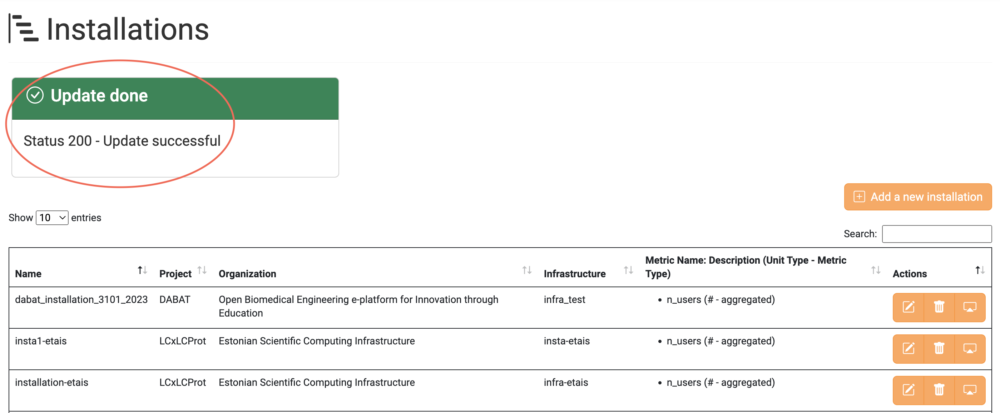
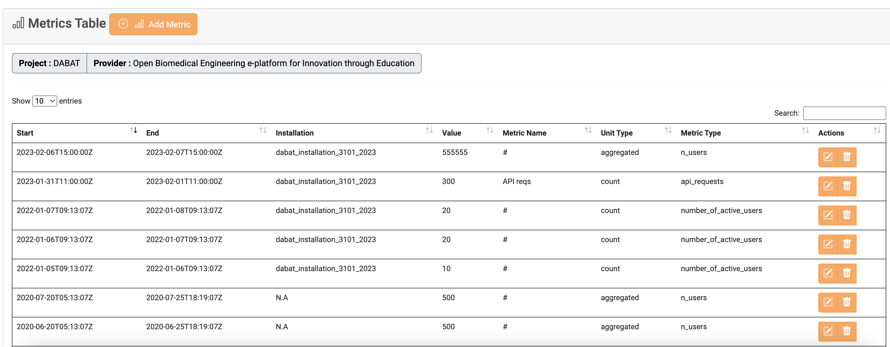
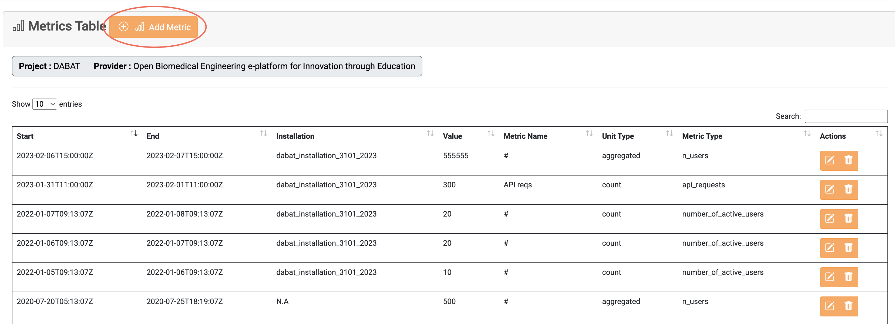
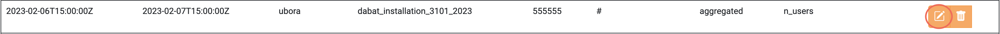
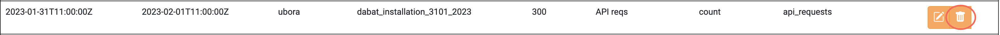

In the <a href="https://accounting.eosc-portal.eu/installations">Installations</a> tab, you can find all the Installations associated with a Project, and you have been granted rights to them 
either as **Project Admin**, **Provider Admin** or **Installation Admin**.

Please refer to Installation [collection](docs/api/installation.md) for more details.

### View all the Installations you have access to

To view all the Installation you have access to, you should visit the <a href="https://accounting.eosc-portal.eu/installations">Installation</a> tab on the Accounting User Interface.
Then, all the aforementioned Installation are displayed.

### Create a new Installation

Click the `Add a new Installation` button to insert a new Installation.

Choose the Project and Provider you want to insert a new Installation, fill in the rest form with your preferred values and click the `Submit` button.

If the Installation is successfully created, the following message is displayed.

### Update an existing Installation

Click the highlighted button on an Installation you want to update.

Change the values that you want and click the `Submit` button.

If the Installation is successfully updated, the following message is displayed.

### Delete an existing Installation

Click the highlighted button on an Installation you want to delete.

To delete the chosen Installation click the `Delete Installation` button.

If the Installation is successfully deleted, the following message is displayed.

### Collect Metrics from specific Installation

You can collect all Metrics under a specific Installation by clicking on the highlighted button.

Then, the Metrics belonging to the selected Installation are displayed.

### Manage Installation Metrics

As mentioned in the previous section, the Installation Metrics are displayed by selecting the highlighted button. You can manage all Installation Metrics and create new ones in this tab.

#### Add a new Metric 

Click the `Add Metric` button to insert a new Metric to the selected Installation.

#### Update an existing Metric

Click the highlighted button on a Metric you want to edit.

#### Delete an existing Metric

Click the highlighted button on a Metric you want to delete.

