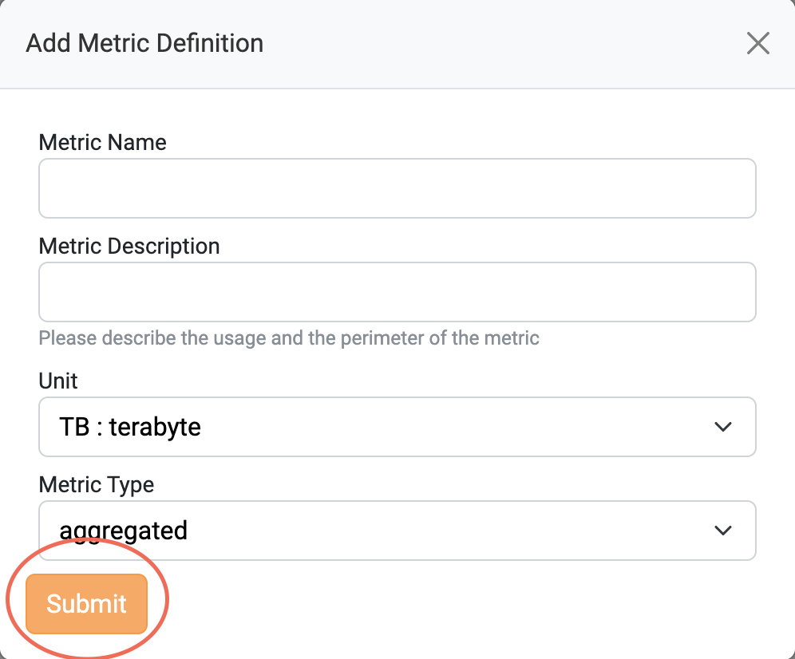
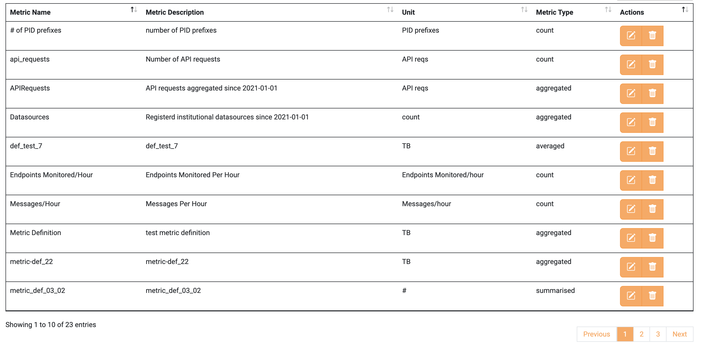
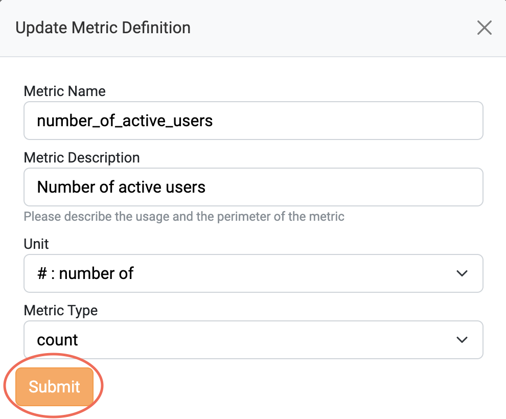

Please refer to Metric Definition <a href="https://argoeu.github.io/argo-accounting/docs/api/metric_definition">collection</a> for more details.
To manage the Metric Definitions via a website, please visit the Metric Definition tab on the <a href="https://accounting.eosc-portal.eu/metrics-definitions">Accounting User Interface</a>.

### Create a Metric Definition

To create a new Metric Definition click the `Add a new Metric Definition` button.

Fill in the form with your preferred values and click the `Submit` button.

If the Metric Definition is successfully created, the following message is displayed.

### View all the Metric Definitions

To view all the Metric Definitions, you should visit the <a href="https://accounting.eosc-portal.eu/metrics-definitions">Metric Definition tab</a> on the Accounting User Interface.
Then, all the created Metric Definitions by any client are displayed.

### Update a Metric Definition

Click the `Actions` button on a Metric Definition you want to update.

In the pop-up menu, choose `Update Metric Definition`.

Change the values that you want and click the `Submit` button.

If the Metric Definition is successfully updated, the following message is displayed.

### Delete a Metric Definition

Click the `Actions` button on a Metric Definition you want to delete.

In the pop-up menu, choose `Delete Metric Definition`.

To delete the chosen Metric Definition click the `Delete Metric Definition` Button.

If the Metric Definition is successfully deleted, the following message is displayed.

