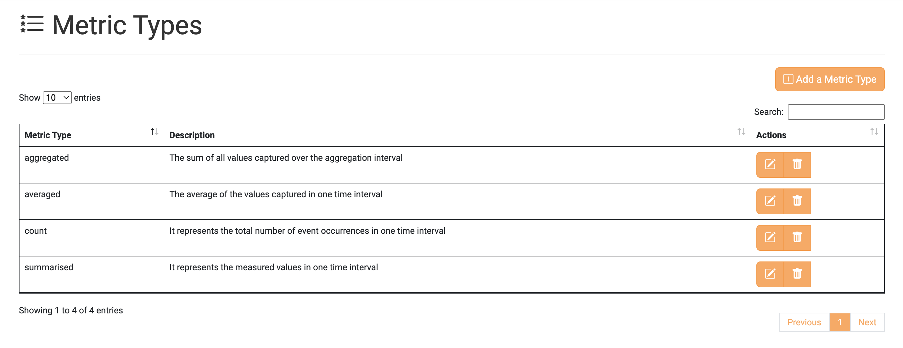
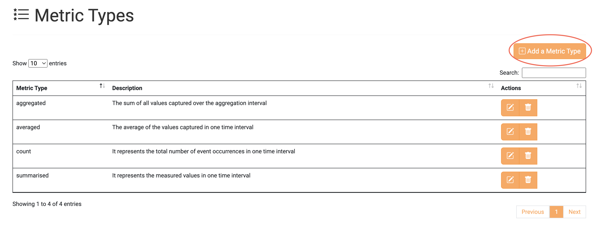
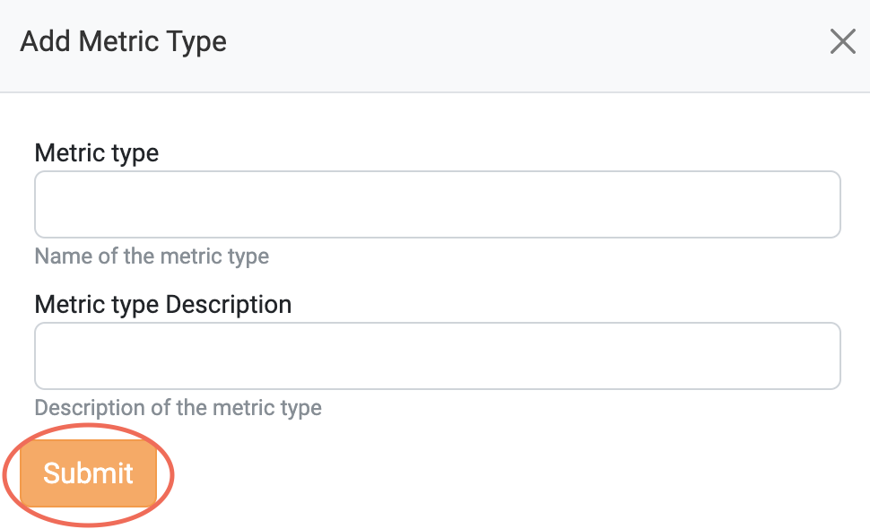
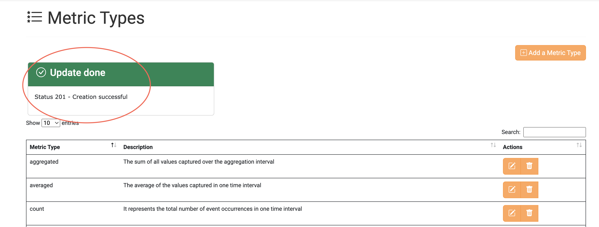
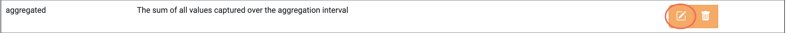
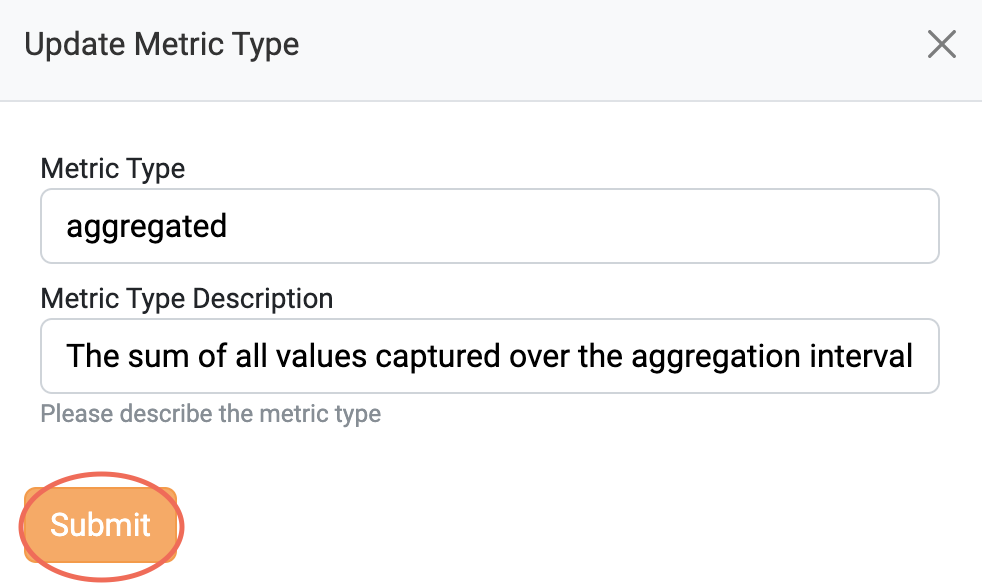
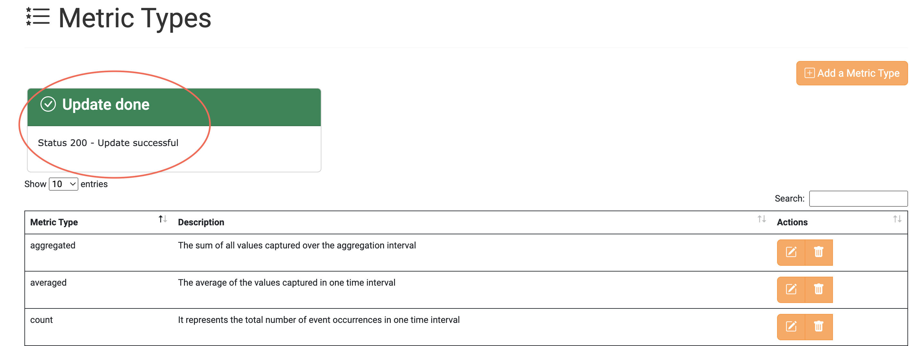
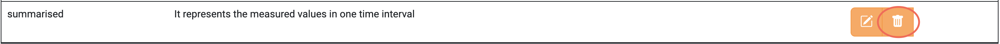
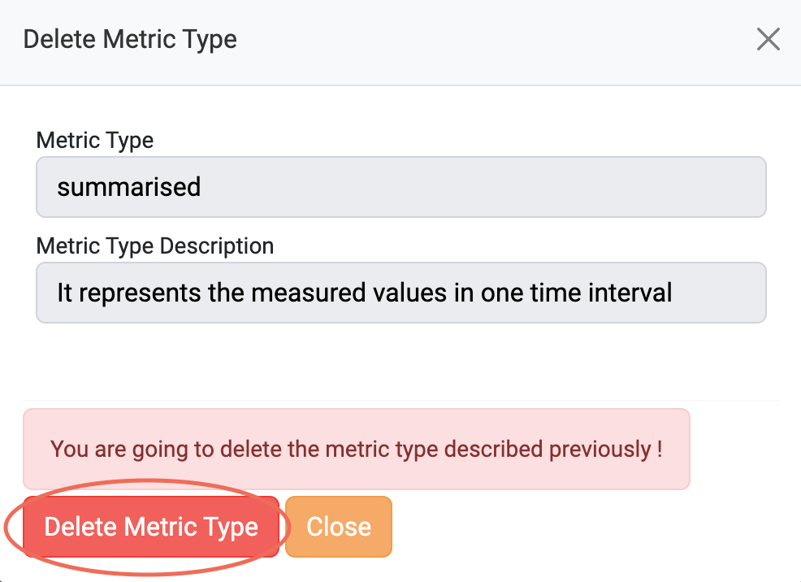
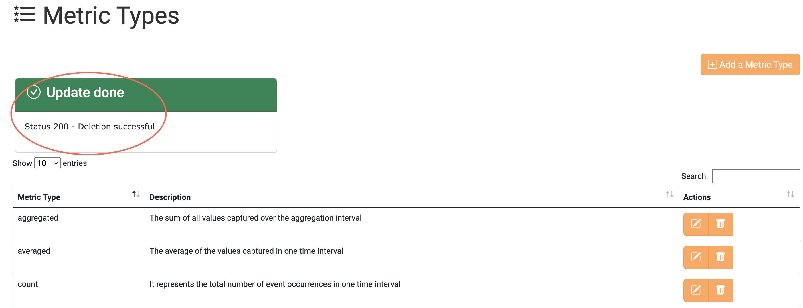

To manage the Metric Types via a website, please visit the <a href="https://accounting.eosc-portal.eu/metric-types">Metric Types</a> tab.

Please note that all available actions are described in this section. The role that the client has obtained may not grant them access to some or all actions.

Please refer to Metric Type [collection](/docs/api/metric_type.md) for more details.

### View all the Metric Types

To view all the Metric Types, you should visit the <a href="https://accounting.eosc-portal.eu/metric-types">Metric Types</a> tab on the Accounting User Interface.
Then, all the created Metric Types by any client are displayed.

### Create a Metric Type

To create a new Metric Type click the `Add a Metric Type` button.

Fill in the form with your preferred values and click the `Submit` button.

If the Metric Type is successfully created, the following message is displayed.

### Update a Metric Type

Click the highlighted button on a Metric Type you want to update.

Change the values that you want and click the `Submit` button.

If the Metric Type is successfully updated, the following message is displayed.

### Delete a Metric Type

Click the highlighted button on a Metric Type you want to delete.

To delete the chosen Metric Type click the `Delete Metric Type` button.

If the Metric Type is successfully deleted, the following message is displayed.

