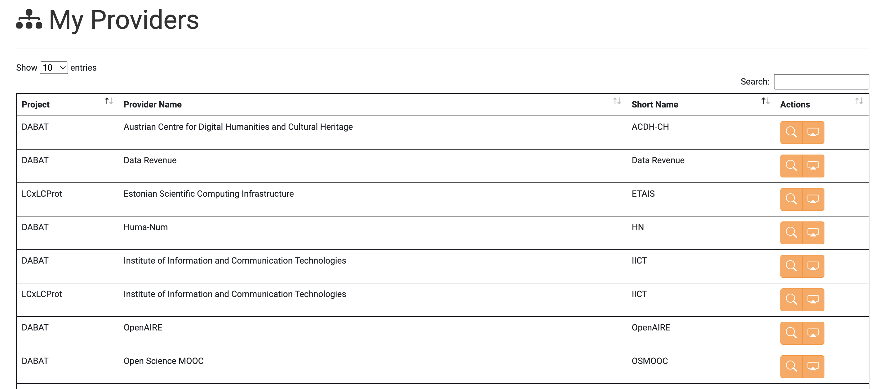
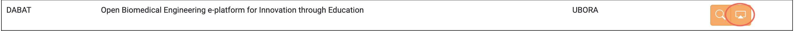
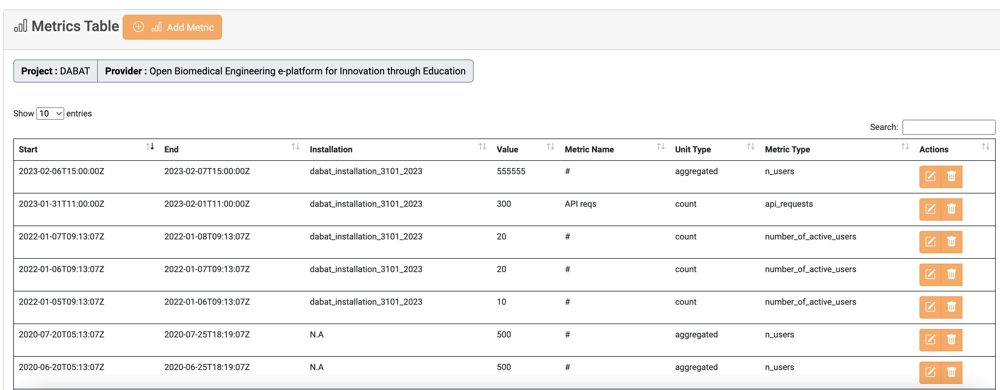
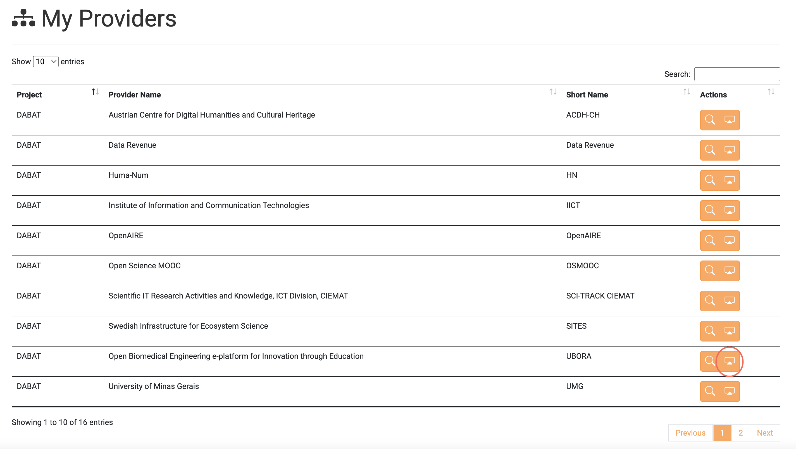
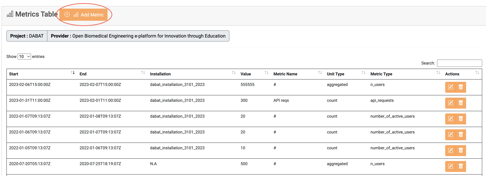
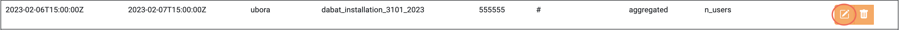
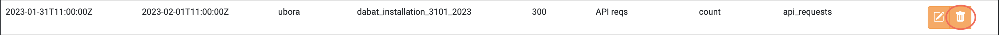

# My Providers

In the [My Providers tab](https://accounting.eosc-portal.eu/myProviders), you
can find all the Providers associated with a Project, and you have been granted
rights to them either as **Project Admin** or **Provider Admin**.

## View all the Providers you have access to

To view all the Providers you have access to, visit the [My Providers tab](https://accounting.eosc-portal.eu/myProviders)
on the Accounting User Interface.
Then, all the aforementioned Providers are displayed.

## Collect Metrics from specific Provider

You can collect all Metrics under a specific Provider by clicking on the
highlighted button.

Then, the Metrics belonging to the selected Provider are displayed.

## Manage Provider Metrics

As mentioned in the previous section, the Provider Metrics are displayed by
selecting the highlighted button. You can manage all Provider Metrics and
create new ones in this tab.

### Add a new Metric

Click the `Add Metric` button to insert a new Metric to the selected Provider.

### Update an existing Metric

Click the highlighted button on a Metric you want to edit.

### Delete an existing Metric

Click the highlighted button on a Metric you want to delete.

