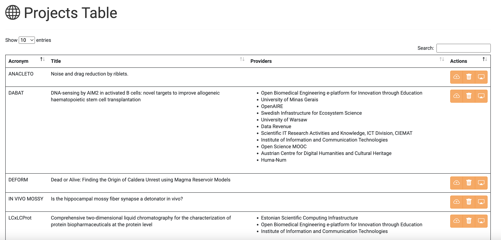
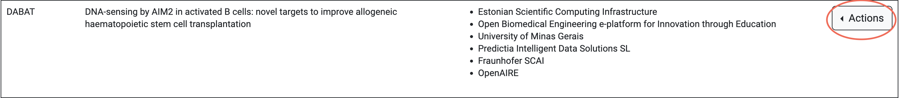
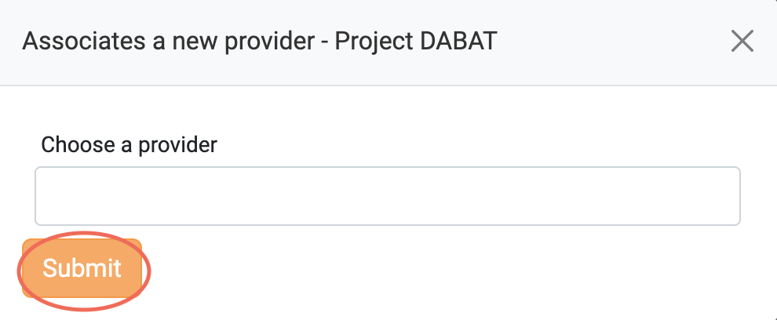
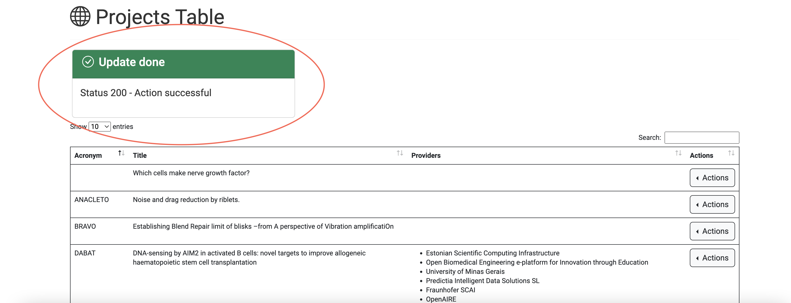
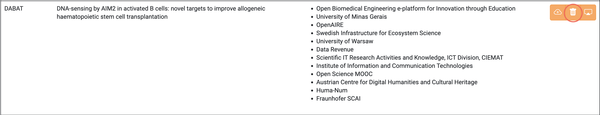
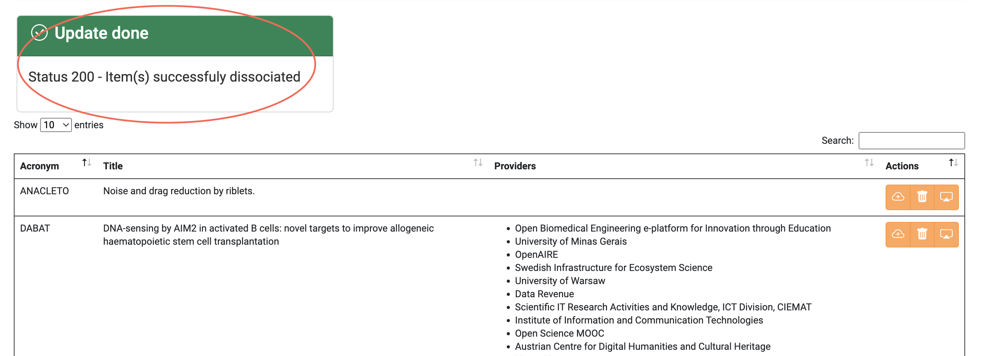
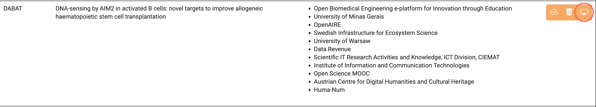
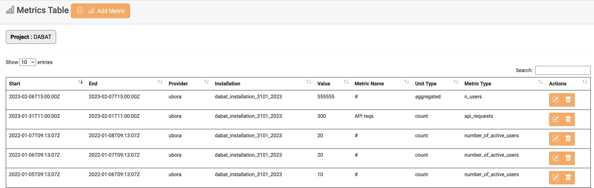
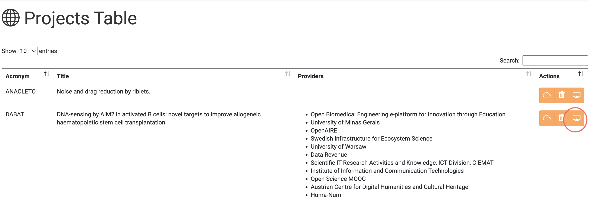
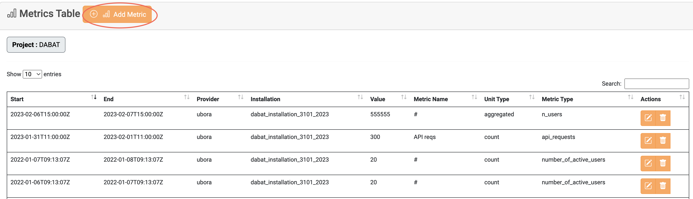

# Projects

In the [Project](https://accounting.eosc-portal.eu/projects) tab, you can find
all the Projects in which you have been granted rights to them as a
**Project Admin**.

Please refer to Project [collection](docs/api/project.md) for more details.

## View all the Projects that have been assigned to you

To view all the Projects that have been assigned to you, you should visit the [Project](https://accounting.eosc-portal.eu/projects)
tab on the Accounting User Interface.
Then, all the aforementioned Projects are displayed.

## Associate Providers with a specific Project

Click the highlighted button on a Project you want to associate a Provider
with.

Select your preferred Providers from the drop-down list and click the `Submit`
button.

If the operation is completed without issues, the following message is
displayed.

## Dissociate Providers from a specific Project

Click the highlighted button on a Project you want to dissociate one or
more Providers from.

Select one or more Providers you want to dissociate from the Project and
click the `Submit` button.

If the operation is completed without issues, the following message is
displayed.

## Collect Metrics from specific Project

You can collect all Metrics under a specific Project by clicking on the
highlighted button.

Then, the assigned Metrics are displayed.

## Manage Project Metrics

As mentioned in the previous section, the Project Metrics are displayed
by selecting the highlighted button. You can manage all Project Metrics
and create new ones in this tab.

### Add a new Metric

Click the `Add Metric` button to insert a new Metric to the selected
Project.

### Update an existing Metric

Click the highlighted button on a Metric you want to edit.

### Delete an existing Metric

Click the highlighted button on a Metric you want to delete.

