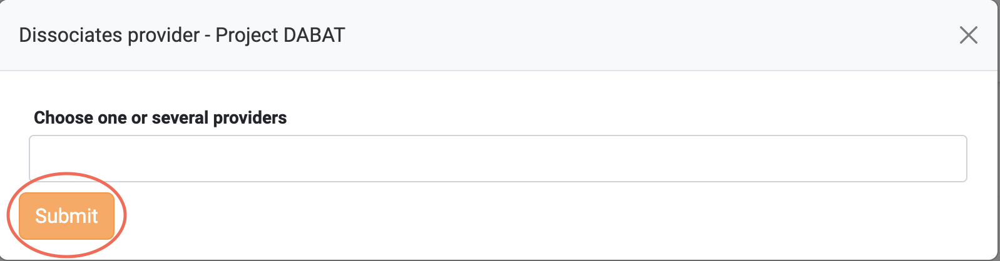

Please refer to Project [collection](docs/api/project.md) for more details.
To manage the Projects via a website, please visit the Project tab on the <a href="https://accounting.eosc-portal.eu/projects">Accounting User Interface</a>.

### View all the Projects that have been assigned to you

To view all the Projects that have been assigned to you, you should visit the <a href="https://accounting.eosc-portal.eu/projects">Project tab</a> on the Accounting User Interface.
Then, all the aforementioned Projects are displayed.

### Associate Providers with a specific Project

Click the highlighted button on a Project you want to associate a Provider with.

Select your preferred Providers from the drop-down list and click the `Submit` button.

If the operation is completed without issues, the following message is displayed.

### Dissociate Providers from a specific Project

Click the highlighted button on a Project you want to dissociate one or more Providers from.

Select one or more Providers you want to dissociate from the Project and click the `Submit` button.

If the operation is completed without issues, the following message is displayed.

### Collect Metrics from specific Project

You can collect all Metrics under a specific Project by clicking on the highlighted button.

Then, the assigned Metrics are displayed.

### Manage Project Metrics

By selecting the highlighted button, the Project Metrics tab is displayed. You can manage all Project Metrics and create new ones in this tab.

#### Add a new Metric 

Click the `Add Metric` button to insert a new Metric to the selected Project.

#### Update an existing Metric

Click the highlighted button on a Metric you want to edit.

#### Delete an existing Metric

Click the highlighted button on a Metric you want to delete.

