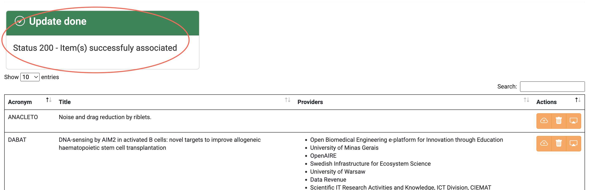

Please refer to Project [collection](docs/api/project.md) for more details.
To manage the Projects via a website, please visit the Project tab on the <a href="https://accounting.eosc-portal.eu/projects">Accounting User Interface</a>.

### View all the Projects that have been assigned to you

To view all the Projects that have been assigned to you, you should visit the <a href="https://accounting.eosc-portal.eu/projects">Project tab</a> on the Accounting User Interface.
Then, all the aforementioned Projects are displayed.

### Associate Providers with a specific Project

Click the `Actions` button on a Project you want to associate a Provider with.

In the pop-up menu, choose `Associates a new Provider`.

Select your preferred Provider from the drop-down list and click the `Submit` button.

If the operation is completed without issues, the following message is displayed.

### Dissociate Providers from a specific Project

Click the `Actions` button on a Project you want to dissociate one or more Providers from.

In the pop-up menu, choose `Dissociates Provider(s)`.

Select one or more Providers you want to dissociate from the Project and click the `Submit` button.

If the operation is completed without issues, the following message is displayed.

