In the <a href="https://accounting.eosc-portal.eu/providers">Provider</a> tab, you can find all the Providers registered from the EOSC Resource Catalogue and the Accounting Service.

Please note that all available actions are described in this section. The role that the client has obtained may not grant them access to some or all actions.

Please refer to Provider [collection](/docs/api/provider.md) for more details.

### View all the registered Providers

To view all the registered Providers, you should visit the <a href="https://accounting.eosc-portal.eu/providers">Providers</a> tab on the Accounting User Interface.
Then, all the registered Providers by any client are displayed.

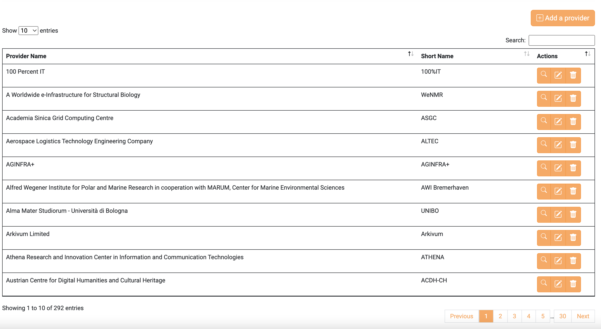

### View Provider details

You can view more information about a particular Provider by clicking the highlighted button.

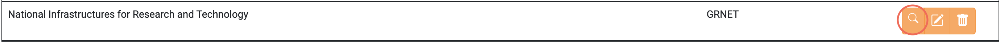

### Create a Provider

To create a new Provider click the `Add a Provider` button.

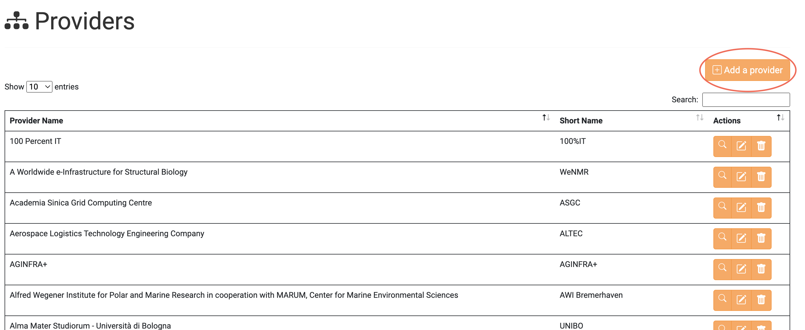

Fill in the form with your preferred values and click the `Submit` button.

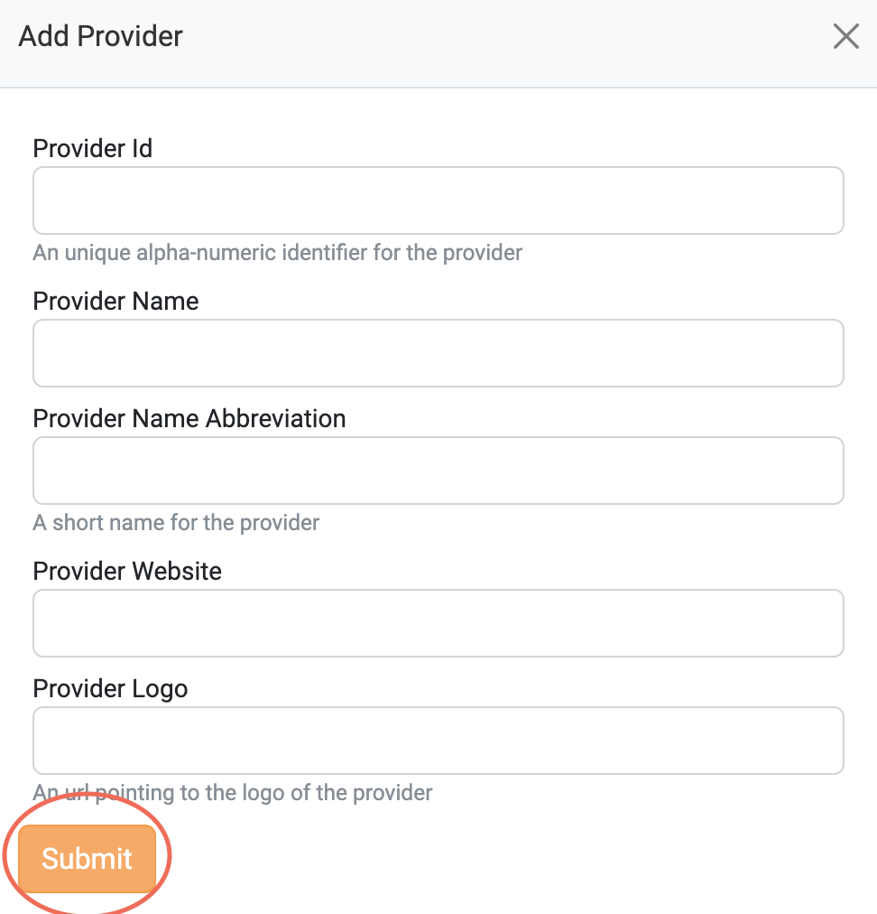

If the Provider is successfully created, the following message is displayed.

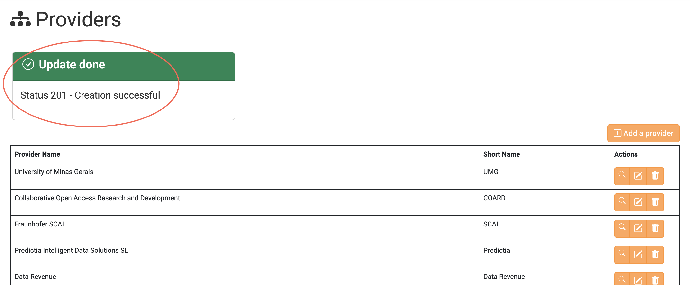

### Update a Provider

Click the highlighted button on a Provider you want to update.

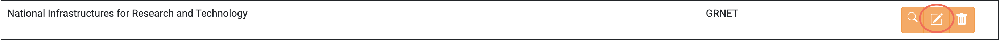

Change the values that you want and click the `Update Provider` button.

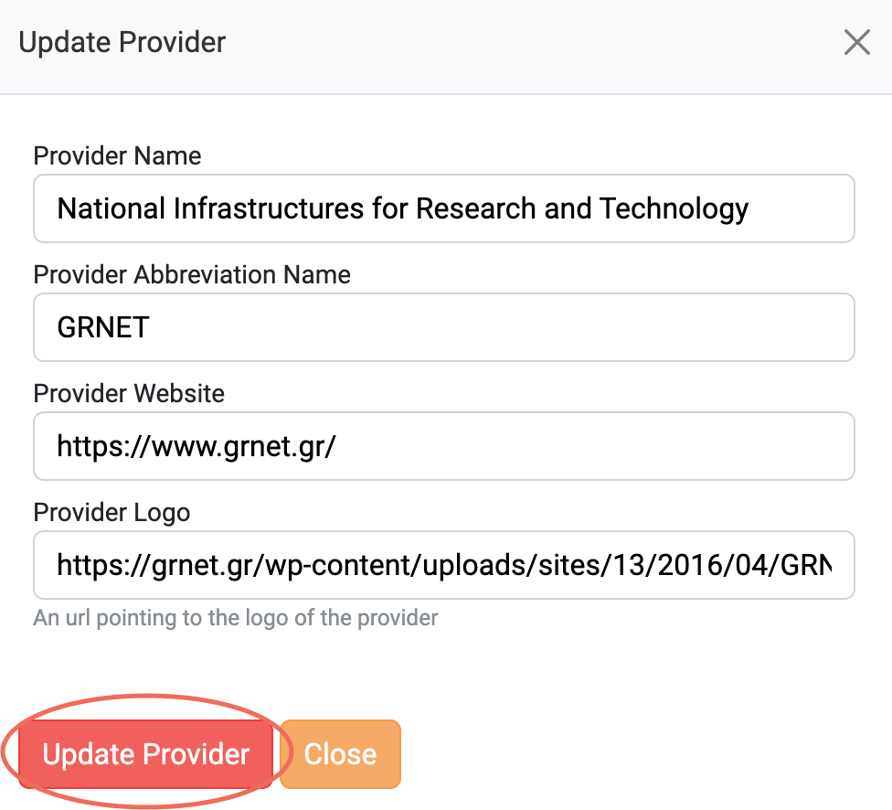

If the Provider is successfully updated, the following message is displayed.

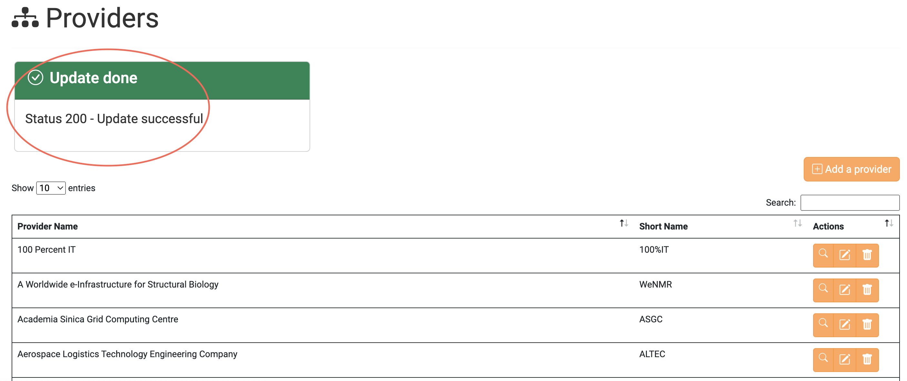

### Delete a Provider

Click the highlighted button on a Provider you want to delete.

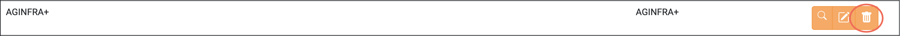

To delete the chosen Provider click the `Delete Provider` button.

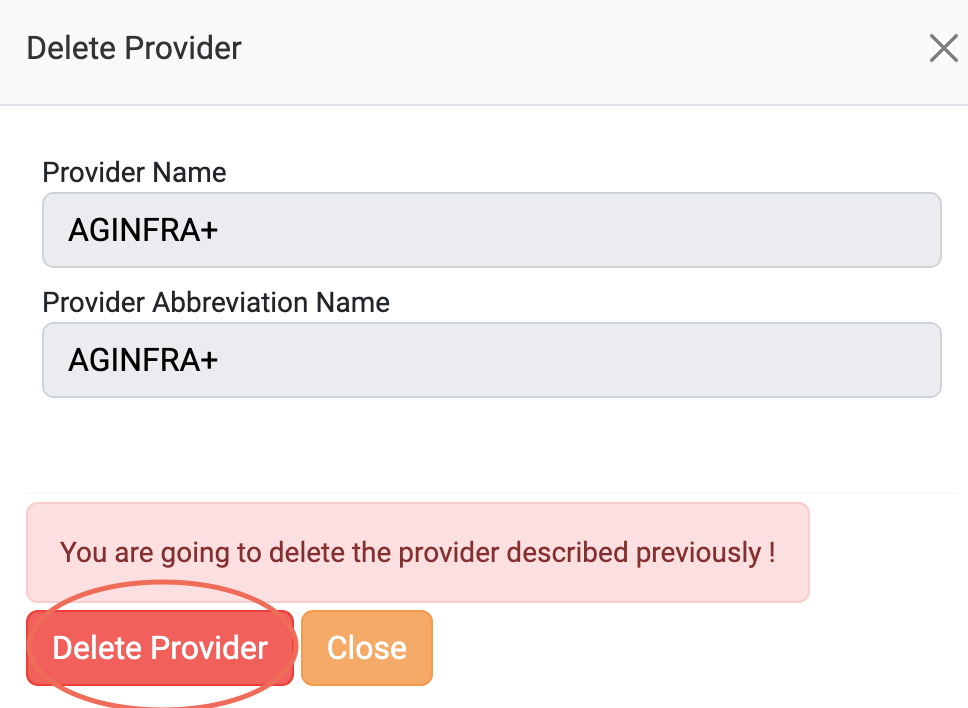

If the Provider is successfully deleted, the following message is displayed.

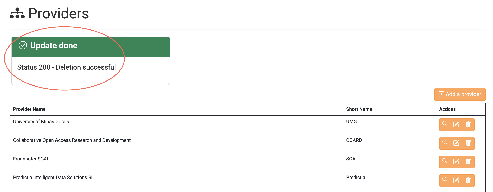
