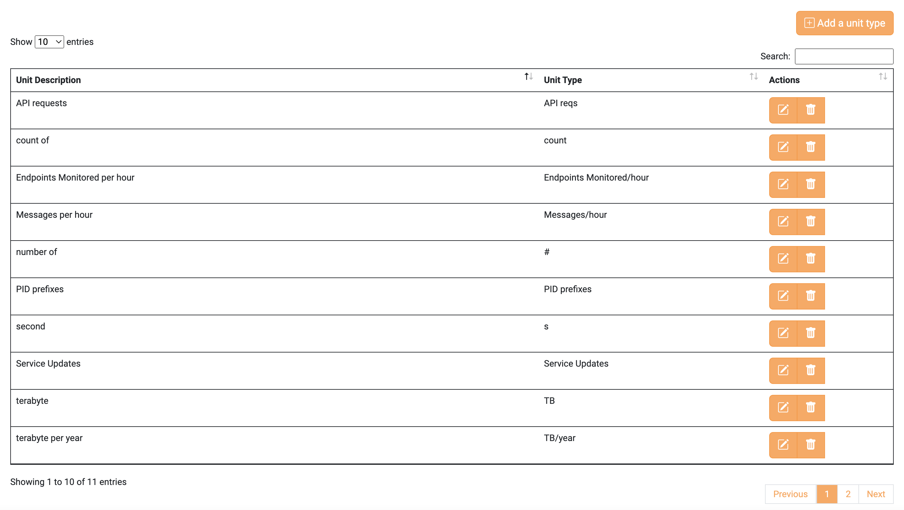
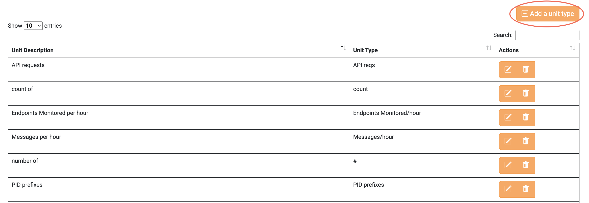
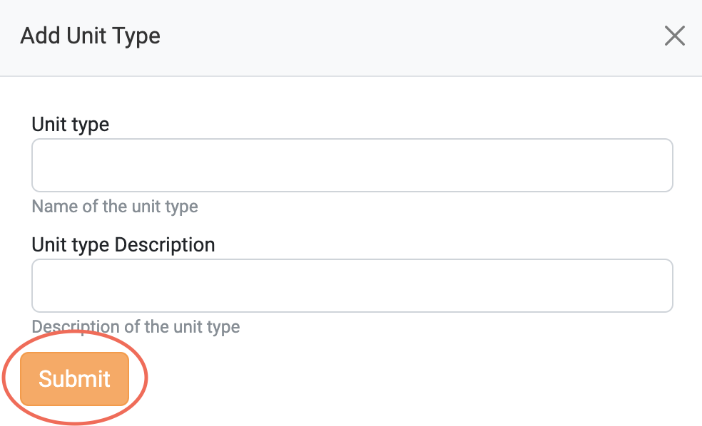
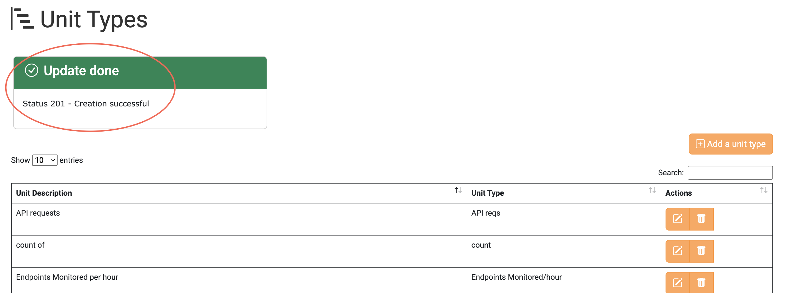
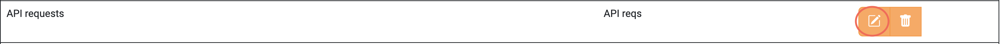
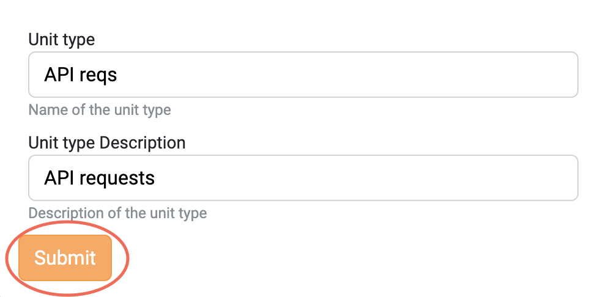
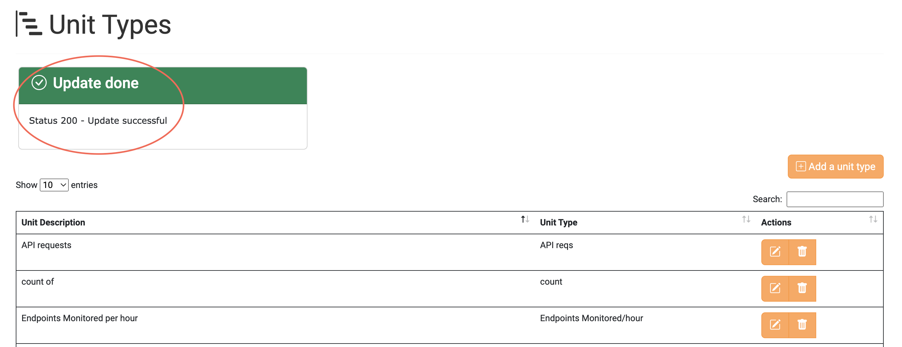
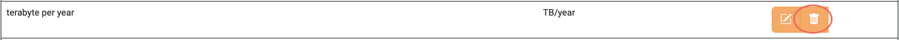
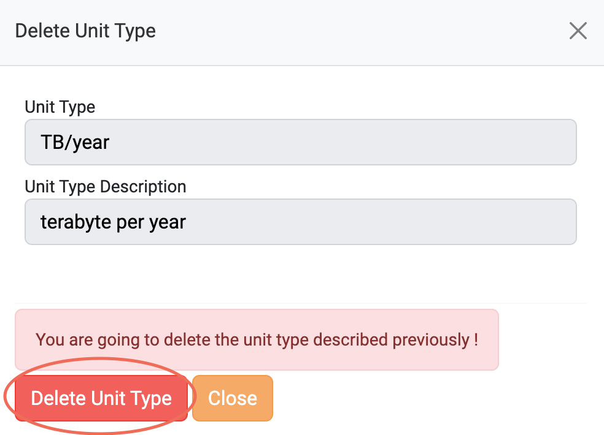
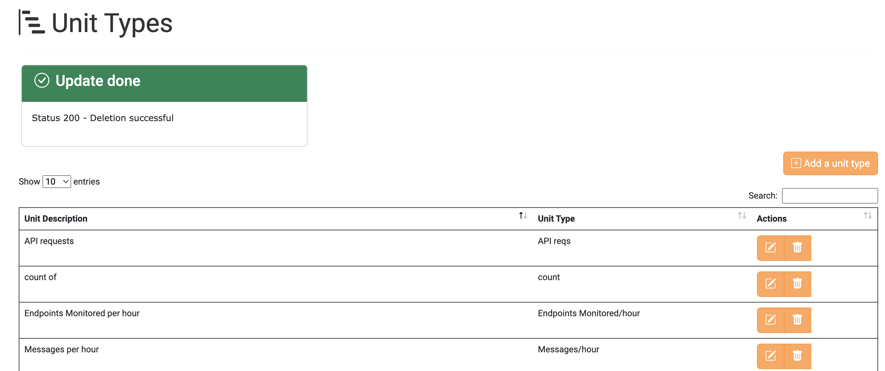

# Unit Types

To manage the Unit Types via a website, please visit the
[Unit Types](https://ui.acc.argo.grnet.gr/unit-types) tab.

Please note that all available actions are described in this section. The role
that the client has obtained may not grant them access to some or all actions.

Please refer to Unit Type [collection](/docs/api/unit_type.md) for more
details.

## View all the Unit Types

To view all the Unit Types, you should visit the [Unit Types](https://ui.acc.argo.grnet.gr/unit-types)
tab on the Accounting User Interface.
Then, all the created Unit Types by any client are displayed.

### Create a Unit Type

To create a new Unit Type click the `Add a unit type` button.

Fill in the form with your preferred values and click the `Submit` button.

If the Unit Type is successfully created, the following message is displayed.

### Update a Unit Type

Click the highlighted button on a Unit Type you want to update.

Change the values that you want and click the `Submit` button.

If the Unit Type is successfully updated, the following message is displayed.

### Delete a Unit Type

Click the highlighted button on a Unit Type you want to delete.

To delete the chosen Unit Type click the `Delete Unit Type` button.

If the Unit Type is successfully deleted, the following message is displayed.

